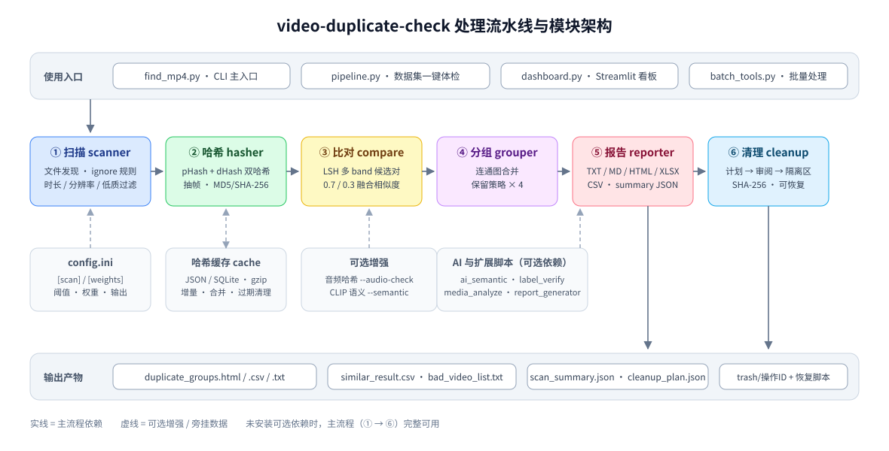
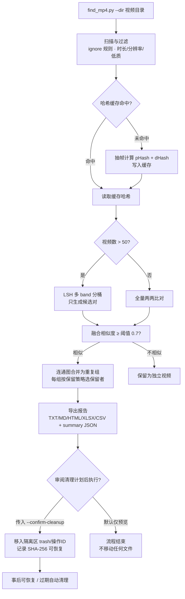

# MP4 视频相似度查重工具

基于感知哈希（pHash + dHash）的本地视频重复检测命令行工具：扫描指定目录，找出画面相似或重复的视频，生成对比报告和可恢复的安全清理方案。适合清理手机、相机、NAS 中堆积的重复素材，也支持为计算机视觉训练集做去重和标注。可选启用 CLIP 语义分析、Streamlit 可视化看板、批量处理与报告生成工具。



## 主流程



感知哈希只看画面不看语义：相似 ≠ 同一内容，执行清理前请人工复核（详见 [docs/algorithm-notes.md](docs/algorithm-notes.md)）。

## 功能特性

- **多格式扫描**：默认 MP4/MOV/MKV/AVI/WebM/M4V/FLV，可用 `--ext` 自定义；支持 `.duplicateignore` / `.globalignore` 排除规则、排除目录和文件大小过滤
- **双哈希融合比对**：pHash + dHash 加权融合（权重可在 config.ini 调整），可选 FFmpeg 音频哈希辅助（`--audio-check`）；元数据预筛加 `--double-check` 二次校验降低误报
- **LSH 分桶加速**：视频数超过 50 时自动启用位掩码分桶，桶数用 `--lsh-buckets` 调整
- **缓存与增量扫描**：哈希缓存（JSON 或 SQLite），支持增量模式、多缓存合并、无效/过期条目清理、gzip 压缩存储
- **多维度保留策略**：每组默认保留文件最大者，可改为按最新修改时间、分辨率或码率保留
- **多格式导出**：分组报告 TXT/MD/HTML/XLSX，明细 CSV，重复与损坏视频纯路径清单，哈希备份，恢复脚本
- **安全清理**：清理计划默认只预览；确认后文件移入带操作 ID 的隔离区并记录 SHA-256，支持执行前校验、事后恢复、按天数清理过期隔离操作
- **自动化集成**：`--summary-json` 导出稳定的 `scan_summary.json`；退出码区分「无重复 / 有重复 / 有解析失败 / 参数错误」
- **筛选**：时长条件（如 `--duration-filter ">=60&<=360"`）、分辨率上下限、AI 低质量画面过滤、时长纯计数模式
- **AI 语义分析（可选）**：CLIP 零样本场景/物体/行为识别、数据集用途判定、语义聚类、训练集清单导出、K-Means 素材自动分类（默认 dry-run 预览）
- **可视化看板（可选）**：Streamlit 交互式看板，10 个面板（总览、重复分组、语义分析、时长/分辨率筛选、缓存管理、任务执行、报告导出、语义检索、标注验证、嫌疑复核）
- **扩展工具集（可选）**：批量多目录扫描、分组缩略图导出、重复素材备份、硬链接替换、素材整理、相似片段提取；元数据 Excel 导出、磁盘空间分析、素材标签、语义检索、快照归档、两次扫描对比；综合 HTML 报告、PDF 导出、质检报告、报告打包
- **数据集一键体检（pipeline.py）**：`find_mp4.py pipeline --dir D:\cam_data --preset surveillance` 一条命令完成 查重 → 标注验证 → 汇总，产出 A/B/C 评级《数据集体检报告》与建议行动清单
- **嫌疑复核工作台（看板面板）**：加载 label_verify 的嫌疑清单，并排播放嫌疑视频与建议标签对照视频，逐项判定（标注正确/改为建议标签/人工指定/跳过），一键导出修正标签 CSV（可直接用于 `--label-from csv`）与复核摘要
- **场景预设**：`--preset surveillance`（固定机位监控：高阈值 + 分组约束 + 运动前景哈希自动启用）/ `--preset footage`（个人素材库）；显式指定的参数优先于预设
- **预标注一致性验证（label_verify.py）**：自动识别文件夹名 / 文件名前缀 / CSV / 正则四种预标注来源，抽帧对比同标签视频的组内相似度（帧哈希 + 运动能量 + 运动前景哈希 + 可选 CLIP），与组间相似度对比后给出"标签是否名副其实"的一致性判定、疑似错标清单（含建议标签）和抽帧对比图（可点击播放原视频）；支持数据用途问卷（训练集/检测/素材库/归档）与针对性参考建议，`--verify-neg` 可用 CLIP 验证 neg 样本确实不含目标行为

## 项目组成

```
video-duplicate-check/
├── find_mp4.py            # 兼容入口（瘦壳）：聚合导出 video_dedup 全部公开名字
├── video_dedup/           # 核心包（v2.9 自 find_mp4.py 按职责拆分）
│   ├── constants.py       #   全局常量 / 输出文件名 / 错误码 / 退出码
│   ├── context.py         #   AppContext 全局状态单例 + 双输出日志系统
│   ├── utils.py           #   路径解析 / 格式化 / 原子写入 / MD5·SHA-256
│   ├── scanner.py         #   目录扫描 + 文件发现 + ignore 规则 + 时长/分辨率/低质过滤
│   ├── cache.py           #   哈希缓存（JSON/SQLite、合并、校验、过期清理、增量进度）
│   ├── hasher.py          #   pHash/dHash 计算 + 关键帧检测 + 音频哈希 + 带缓存提取
│   ├── compare.py         #   LSH 多 band 分桶 + 双哈希融合相似度 + 候选对生成
│   ├── grouper.py         #   连通图分组 + 最低组内相似度拆分 + 保留策略
│   ├── reporter.py        #   CSV/TXT/MD/HTML/XLSX 导出 + 扫描摘要 + 终端汇总
│   ├── cleanup.py         #   安全清理：计划生成/校验/执行/恢复/过期清理
│   ├── cli.py             #   argparse 入口 + 子命令分发 + 主扫描流程
│   ├── label_verify.py    #   转发层（实现见根目录 label_verify.py）
│   └── ai_semantic.py     #   转发层（实现见根目录 ai_semantic.py）
├── ai_semantic.py         # AI 语义分析：CLIP 场景/用途判定、聚类、自动分类（可独立运行）
├── label_verify.py        # 预标注一致性验证：识别预标注 → 抽帧对比 → 错标检测（可独立运行）
├── dashboard.py           # Streamlit 可视化看板（10 个面板）
├── pipeline.py            # 数据集一键体检：查重 + 标注验证 + A/B/C 体检报告
├── review_tools.py        # 嫌疑复核逻辑模块（供看板复核工作台调用）
├── batch_tools.py         # 批量工具：多目录扫描/缩略图/备份/硬链接/整理/片段提取
├── media_analyze.py       # 媒体分析：元数据 Excel/磁盘分析/标签/语义检索/快照/对比
├── report_generator.py    # 报告系统：综合 HTML/PDF/质检/对比/归档
├── config.ini             # 配置文件模板（[scan] / [weights] 段）
├── dataset_labels.ini     # AI 场景、物体、行为、用途标签配置
├── requirements.txt       # 全量依赖（含可选依赖）
├── requirements_ai.txt    # AI 扩展依赖
├── requirements-dev.txt   # 测试/开发依赖（pytest、pytest-cov）
├── install.bat            # Windows 安装脚本（基础版 / AI 增强版二选一）
├── install_ai.bat         # Windows AI 依赖安装脚本（含国内镜像配置）
├── tests/                 # pytest 套件（OpenCV 合成视频 fixture，无需真实素材）
├── docs/algorithm-notes.md # 算法选型笔记：双哈希 / LSH 实验 / CLIP 融合
├── test_demo.py           # 独立自测脚本
└── README.md
```

`find_mp4.py` 内置子命令：`scan`（默认，可省略）、`clean-cache`、`merge-cache`、`verify-cache`、`version`、`validate-plan`、`execute-plan`、`restore-operation`、`list-operations`、`purge-operations`、`semantic-analyze`、`dataset-filter`、`cluster-scene`、`clear-semantic-cache`、`dataset-split`、`duration-stat`、`reload-labels`、`test`、`auto-classify`、`dashboard`。其中 v2.6 的扩展工具子命令（`batch-scan`、`media-info`、`full-report` 等）只是转发到独立模块，实际可用形式见下文「扩展工具」。

## 环境要求

- Python 3.9 及以上（代码使用了 3.9+ 的内置泛型类型标注）
- FFmpeg（可选）：仅 `--audio-check` 音频比对需要
- AI 功能（可选）：torch、open-clip-torch、scikit-learn；未安装时自动降级为纯哈希查重

## 安装

最小安装（纯哈希查重，不含看板/报告/AI）：

```bash
pip install opencv-python numpy Pillow imagehash tqdm psutil
```

完整安装（`requirements.txt` 同时包含上述基础依赖和 streamlit、plotly、pandas、openpyxl、reportlab、torch 等可选依赖）：

```bash
pip install -r requirements.txt
```

仅追加 AI 语义分析依赖：

```bash
pip install -r requirements_ai.txt
```

Windows 下也可以运行 `install.bat`（交互选择基础版或 AI 增强版）或 `install_ai.bat`（配置国内镜像并安装全部依赖）。

可选依赖的对应关系：Excel 导出需要 openpyxl；PDF 导出需要 reportlab（优先）或 weasyprint（备选）；看板需要 streamlit、plotly、pandas；语义分析需要 requirements_ai.txt 中的四件套。

## 快速开始

```bash
# 最基础用法：扫描 D:\Videos 并输出重复分组（默认 TXT 报告）
python find_mp4.py --dir D:\Videos

# 导出 HTML 报告（含缩略图）
python find_mp4.py --dir D:\Videos --format html

# 快速粗筛（更少帧数、更高阈值）
python find_mp4.py --dir D:\Videos --fast

# 高精度模式：提高阈值、增加采样帧数、开启二次校验
python find_mp4.py --dir D:\Videos --threshold 0.85 --frames 15 --double-check

# 增量扫描：仅处理新增或修改过的视频
python find_mp4.py --dir D:\Videos --incremental

# 只扫描指定格式
python find_mp4.py --dir D:\Videos --ext mp4,mov,mkv

# 导出机器可读摘要，供脚本/看板/CI 读取
python find_mp4.py --dir D:\Videos --summary-json --output-dir D:\Reports
```

一次扫描默认在输出目录生成：`similar_result.csv`（明细）、`duplicate_groups.txt`（或所选格式的分组报告）、`duplicate_paths.txt`（重复文件路径清单）、`bad_video_list.txt`（无法解析的视频）。

**退出码**：`0` 无重复；`1` 存在重复分组；`2` 存在解析失败的视频；`3` 参数错误。可直接用于定时任务和 CI 判断。

## 常用参数

| 类别 | 参数 | 说明 |
|------|------|------|
| 范围 | `--ext`、`--no-recursive`、`--exclude-folder`、`--exclude-size-lt/gt` | 后缀、递归、排除目录、大小过滤 |
| 比对 | `--threshold`（默认 0.7）、`--frames`（默认 10）、`--fast`、`--double-check`、`--lsh-buckets`、`--use-md5` |
| 分组/标注 | `--group-min-sim`（组内最低相似度约束，complete-linkage 拆分，0=关闭）、`--label-regex`（分组混合标注告警） |
| 预设 | `--preset surveillance`（固定机位监控）/ `--preset footage`（素材库）；`pipeline` 子命令一键体检 |、`--audio-check` | 相似度与校验策略 |
| 保留 | `--keep-latest`、`--keep-max-res`、`--keep-max-bitrate` | 每组保留策略，默认保留文件最大者（`--keep-max-size` 为显式声明） |
| 筛选 | `--duration-filter`、`--duration-stat`、`--duration-export`、`--min-res`、`--max-res`、`--skip-low-quality` | 时长/分辨率/质量过滤 |
| 输出 | `--format`、`--output-dir`、`--output-prefix`、`--min-sim`、`--path-mask`、`--lite-csv`、`--export-clean-list`、`--export-bad-paths`、`--export-hash`、`--gen-restore`、`--summary-json`、`--gen-cleanup` | 报告与清单 |
| 安全 | `--dry-run`、`--quiet`、`--protect-folder`、`--protect-file`、`--backup-path`、`--hard-delete` | 保护与删除控制 |
| 缓存 | `--no-cache`、`--incremental`、`--clean-cache`、`--verify-cache`、`--merge-cache`、`--cache-expire-days`、`--compress-cache`、`--no-store-frames` | 缓存管理 |

完整参数见 `python find_mp4.py --help`。

## 安全清理流程

扫描生成清理计划后，按「校验 → 预览 → 确认 → 可恢复」执行：

```bash
# 1. 扫描并生成清理计划（发现重复分组时输出 cleanup_plan.json）
python find_mp4.py --dir D:\Videos --gen-cleanup --format html

# 2. 校验计划中的文件是否仍存在且大小未变（扫描后文件可能已变动）
python find_mp4.py validate-plan cleanup_plan.json

# 3. 预览执行：默认不移动任何文件
python find_mp4.py execute-plan cleanup_plan.json

# 4. 确认执行：移入 <计划目录>\trash\<操作ID>\，并写入含 SHA-256 的 operation.json
python find_mp4.py execute-plan cleanup_plan.json --confirm-cleanup

# 5. 恢复：默认预览；加 --confirm-restore 后校验大小与 SHA-256（内容变化时跳过）
python find_mp4.py restore-operation trash\<操作ID>\operation.json --confirm-restore

# 6. 列出隔离区中的全部清理操作
python find_mp4.py list-operations trash

# 7. 清理过期隔离操作：默认仅预览超过 30 天的操作，确认后永久删除
python find_mp4.py purge-operations trash --older-than 30
python find_mp4.py purge-operations trash --older-than 30 --confirm-purge
```

`--protect-folder` / `--protect-file` 可声明保护目录和保护清单，`--backup-path` 在清理前把待删文件备份到指定目录。`--hard-delete` 走永久删除脚本路径，需要交互终端输入 YES 确认。

## 扫描摘要 JSON（自动化集成）

`--summary-json` 输出的 `scan_summary.json` 包含：`schema_version`、`status`（`clean` / `duplicates_found` / `completed_with_errors`）、`total_videos`、`hash_success`、`parse_failures`、`duplicate_groups`、`duplicate_videos`、`reclaimable_bytes`（可释放字节数）、`groups`（成员路径、最高相似度、重复等级）、`extensions`（格式分布）、`quality_buckets`（`exact_or_reencoded` / `highly_similar` / `possibly_similar` / `weak_match`）。

外部程序只需读取该文件即可获得扫描结果，无需解析终端日志；建议先检查 `schema_version` 再读取字段。

## 扩展工具

三个扩展模块依赖主程序的缓存与核心逻辑，请在仓库根目录直接运行（通过 `python find_mp4.py <子命令>` 转发时，模块专属参数无法透传，见「已知边界」）。

### batch_tools.py — 批量处理

```bash
# 多目录批量扫描：dirs.txt 一行一个目录（# 开头为注释行），
# 合并各目录已发现的缓存，并输出 batch_scan_report.txt（名称+大小级重复提示）
python batch_tools.py batch-scan --dir-list dirs.txt --output-dir batch_output

# 按重复分组导出首帧缩略图集
python batch_tools.py export-thumbnails --groups-json groups.json

# 批量备份待清理的重复视频
python batch_tools.py backup-duplicates --groups-json groups.json --backup-dir D:\backup

# 批量把重复视频替换为硬链接（节省磁盘，替换前建议先备份）
python batch_tools.py replace-hardlinks --groups-json groups.json

# 按用途/时长/分辨率整理素材（默认 dry-run 预览）
python batch_tools.py organize --dir D:\Videos --organize-by duration

# 提取两段视频高度相似的时间区间，输出 Markdown 报告
python batch_tools.py extract-segments --video1 v1.mp4 --video2 v2.mp4
```

`export-thumbnails` / `backup-duplicates` / `replace-hardlinks` 的 `--groups-json` 需要是主程序内部格式的分组 JSON（成员为「序号 + 文件信息」列表）；`scan_summary.json` 的分组结构与之不同，不能直接作为输入。文件操作类子命令均支持 `--dry-run` 预览。

### media_analyze.py — 媒体分析

```bash
# 批量导出视频元数据到 Excel（需 openpyxl）
python media_analyze.py media-info D:\Videos -o media_info.xlsx

# 基于缓存生成磁盘空间优化报告（Markdown）
python media_analyze.py space-analyze video_hash_cache.json

# 素材标签管理：add / remove / list / export
python media_analyze.py tag-manage add D:\v.mp4 --tag 精品素材
python media_analyze.py tag-manage list
python media_analyze.py tag-manage export --export-path tags.txt

# 语义检索：按文字描述找视频（依赖缓存中的 CLIP 特征，先完成语义分析）
python media_analyze.py similar-search "城市街道夜景" video_hash_cache.json --top-k 10

# 导出快照存档（缓存 + 报告打包 zip）
python media_analyze.py export-snapshot snapshot.zip

# 两次扫描对比报告
python media_analyze.py diff-scan old_cache.json new_cache.json
```

### report_generator.py — 报告系统

基于扫描产生的哈希缓存文件工作（先运行一次扫描），而非直接扫描目录：

```bash
# 综合汇总 HTML 报告
python report_generator.py full-report --cache video_hash_cache.json --project-name "项目A"

# HTML 转 PDF（需 reportlab 或 weasyprint，可加水印）
python report_generator.py export-pdf --html full_report.html --pdf 项目A.pdf --watermark "机密"

# 磁盘空间优化报告 / AI 数据集质检报告（Markdown）
python report_generator.py space-report --cache video_hash_cache.json
python report_generator.py quality-report --cache video_hash_cache.json

# 两份缓存的数据对比报告
python report_generator.py diff-report --old old_cache.json --new new_cache.json

# 把报告目录打包为 zip
python report_generator.py archive --reports-dir D:\Reports
```

## 可视化看板

```bash
# 方式一：直接启动
streamlit run dashboard.py

# 方式二：通过主程序启动
python find_mp4.py dashboard
```

启动后浏览器访问 <http://localhost:8501>。看板包含 8 个面板：

1. **总览大盘** — 视频总量、重复分组、可释放空间、分辨率/时长分布图
2. **重复分组详情** — 表格 + 缩略图 + 相似度，支持导出清理清单
3. **AI 语义分析** — 场景分布、用途占比、质量统计
4. **时长 & 分辨率筛选** — 直方图 + 交互式滑块
5. **缓存管理** — 缓存大小、条目数、清理
6. **任务执行** — 表单配置参数，通过子进程发起扫描/语义分析/自动分类/时长统计
7. **报告导出** — 在线预览并生成综合 HTML、空间/质检报告与打包归档
8. **语义检索** — 按文字描述检索缓存中的视频

## AI 语义分析与自动分类（可选）

```bash
pip install -r requirements_ai.txt

# 扫描时同时进行 CLIP 语义分析
python find_mp4.py --dir D:\Videos --semantic

# 仅执行语义分析 / 按用途筛选 / 语义聚类 / 数据集导出
python find_mp4.py semantic-analyze --dir D:\Videos
python find_mp4.py --dir D:\Videos --semantic --purpose-filter 监控训练集
python find_mp4.py --dir D:\Videos --semantic --cluster-semantic
python find_mp4.py --dir D:\Videos --semantic --export-dataset --skip-low-quality

# AI 自动分类：默认 dry-run 预览，确认后 --execute 执行（--link-mode 用硬链接代替移动）
python find_mp4.py auto-classify --dir D:\Videos
python find_mp4.py auto-classify --dir D:\Videos --execute --link-mode
```

- 场景、物体、行为和数据集用途标签在 `dataset_labels.ini` 中配置，改完重新运行 `--semantic` 即可生效（`reload-labels` 子命令可热加载）

## 预标注一致性验证（label_verify.py）

当视频已经带有人工预标注（文件夹名、文件名前缀、CSV、或嵌入文件名的结构化字段）时，
本工具回答："**带相同标签的视频，是否真的表现出相同的行为/画面？**"适用于数据集清洗与标注质检。

```bash
# 自动识别预标注（优先文件夹名，其次文件名前缀）
python label_verify.py --dir D:\labeled_videos

# 文件名内嵌标注：用正则提取（第 1 个捕获组为标签）
# 例如 20260909-cam01_closeup-dog_come-pos-daytime-276.mp4 → 标签 closeup-dog_come
python label_verify.py --dir D:\cam_data --label-regex "cam01_(.+?)-(?:pos|neg|night)"

# CSV 标注文件（列名支持 filename/path + label/标签）
python label_verify.py --dir D:\data --label-from csv --labels-csv labels.csv

# 启用 CLIP 语义特征（需 torch/open-clip-torch，首次运行需下载权重，失败自动换 hf-mirror）
python label_verify.py --dir D:\data --use-clip

# 固定机位监控数据：运动前景哈希（多帧中值估计背景，仅前景差异区域参与比对）
python label_verify.py --dir D:\cam_data --motion-hash

# 训练集清洗：指定数据用途获得针对性建议 + CLIP 验证 neg 样本确实不含目标行为
python label_verify.py --dir D:\cam_data --purpose train --use-clip --verify-neg

# 数据用途不指定且在交互终端运行时会现场询问（train/detection/retrieval/archive/general）

# 固定机位场景预设：自动开启 --motion-hash 并收紧嫌疑阈值至 0.55
python label_verify.py --dir D:\cam_data --preset surveillance

# 机器可读摘要（供 pipeline 使用）：额外导出 label_verify_summary.json
python label_verify.py --dir D:\cam_data --summary-json
```

特征 = 帧哈希 pHash+dHash（权重 0.6，与主程序同算法）+ 运动能量（帧间差分，权重 0.4）+ CLIP（可选）；
`--motion-hash` 额外引入前景差分哈希（背景用多帧中值估计），固定机位场景下显著提升区分度，并统计"静止机位占比"。
判定规则：组内相似度低于阈值 / 显著偏离标签均值 / 与其他标签更相似（跨标签吸引力，同时给出建议标签）/ neg 样本被 CLIP 判断疑似包含目标行为（`--verify-neg`）。

输出（默认在 `--dir` 下 `_label_verify\` 目录）：

| 文件 | 内容 |
|------|------|
| `label_verify_report.md` | 组内/组间相似度、分离度、轮廓系数、各标签判定与建议总结、混淆矩阵、数据用途参考建议、疑似清单 |
| `label_verify_suspects.csv` | 疑似标注不一致清单（当前标签、建议标签、原因） |
| `label_verify_frames.html` | 抽帧对比图（按标签折叠分组 + 锚点导航，疑似项标红，每组附自动建议，点击『▶ 播放』内嵌播放原视频） |

退出码：0=全部一致；1=发现疑似不一致；2=有解析失败；3=参数/数据错误。

> 注意：帧哈希衡量画面外观、运动能量近似行为强度。同标签但场景完全不同的视频（如不同街道的"行走"）
> 哈希相似度天然偏低，属预期现象，此时应以运动能量与 CLIP 特征为主判断；结论仅供清洗参考，不能替代人工复核。
- `--clip-model-path` 可指定本地 CLIP 模型；`--embed-cache` 持久化特征向量供语义检索复用
- 未安装 AI 依赖时上述功能会给出提示并跳过，纯哈希查重不受影响

## 配置文件

`config.ini` 放在 `find_mp4.py` 同目录，或用 `--config` 指定路径；命令行参数优先于配置文件。实际生效的是 `[scan]` 段（扫描参数）和 `[weights]` 段（相似度权重）：

```ini
[scan]
dir = D:\Videos
threshold = 0.7
frames = 10
format = html
incremental = false
duration_filter = >=60
min_res = 0
semantic = false

[weights]
phash_weight = 0.7
dhash_weight = 0.3
audio_weight = 0.8
```

`[scan]` 支持的键与同名命令行参数一致（如 `duration_filter` 对应 `--duration-filter`）。仓库内的 `config.ini` 是带注释的完整模板。

## 测试与自检

### pytest 套件（推荐）

```bash
pip install -r requirements-dev.txt

# 全量测试（OpenCV 现场合成测试视频，无需真实素材，约 5 秒）
pytest

# 带覆盖率报告
pytest --cov=video_dedup --cov-report=term-missing

# 只跑某一模块的测试
pytest tests/test_lsh.py        # LSH 分桶与召回回归
pytest tests/test_similarity.py # 相似度融合与阈值边界
```

测试覆盖：哈希确定性/鲁棒性（test_hashing）、LSH 召回回归（test_lsh）、
相似度融合与阈值边界（test_similarity）、分组与保留策略（test_grouper）、
安全清理全流程含 SHA-256 恢复（test_cleanup）、预标注识别与判定（test_label_verify）、
报告导出与清理脚本生成（test_reporter）、端到端退出码契约 0/1/2/3 与
scan_summary.json schema（test_end_to_end）。参数与算法取舍的推导过程见
`docs/algorithm-notes.md`。

GitHub Actions（`.github/workflows/ci.yml`）在 Ubuntu/Windows × Python 3.9/3.11/3.12
矩阵上自动运行 pytest + 覆盖率与两个遗留自测脚本。

### 遗留自测脚本

```bash
# 独立自测脚本：构造测试视频跑通扫描、导出、筛选等主要流程
python test_demo.py

# 主程序内置核心逻辑测试（LSH 分桶、时长筛选、相似度计算等）
python find_mp4.py test

# 核心回归测试（改代码后必跑）：错标注入检测 / 场景预设参数 /
# 分组最低相似度拆分 / 复核结果导出映射 —— 4 用例约 10 秒
python test_regression.py
```

## 已知边界

- 扩展子命令（`batch-scan`、`media-info`、`label-verify` 等）的模块专属参数自 v2.7 起可直接转发（主程序参数解析改为宽松模式，未知参数由被委托模块自行解析），模块返回的整数退出码也会透传。
- pHash/dHash 是画面相似度筛选手段，不是内容鉴定：相似不等于同一内容。执行清理前请务必人工复核清理计划，重要素材先备份。
- `similar-search` 依赖缓存中的 CLIP 特征（`semantic_emb`），需要先对相应目录完成语义分析。
- 本仓库以 [MIT License](LICENSE) 开源。

## 版本历史

- **v2.9.0** — 工程化重构：`find_mp4.py`（5600+ 行单文件）按职责拆分为 `video_dedup/` 包（scanner/hasher/compare/grouper/cleanup/reporter/cache/cli 等 11 个模块），`find_mp4.py` 变为聚合导出的瘦入口，全部既有 `from find_mp4 import X` 用法保持兼容；接入 pytest 测试套件（141 用例 + 覆盖率 + GitHub Actions 矩阵 CI）；新增 MIT LICENSE 与 `docs/algorithm-notes.md` 算法选型笔记；修复 v2.8 遗留问题：auto-classify 引用未定义的 `scan_videos`（必现 NameError）、HTML 报告成员渲染循环被错误嵌进混合标注条件（普通分组渲染为空）；AI 依赖改为延迟加载，非 AI 路径启动从 ~9s 降到 <0.5s

- **v2.8.0** — 数据集一键体检 `find_mp4.py pipeline`（查重+标注验证+A/B/C 体检报告与建议行动）；看板新增『嫌疑复核』工作台（并排播放对照、逐项判定、导出修正标签 CSV 与复核摘要，review_tools.py）；场景预设 `--preset surveillance/footage`（find_mp4/label_verify/pipeline 三处生效）；label_verify 新增 `--summary-json` 机器可读摘要
- **v2.7.0** — label_verify：运动前景哈希与静止机位检测（`--motion-hash`）、neg 样本 CLIP 行为验证（`--verify-neg`）、数据用途问卷与参考建议（`--purpose`）、每组建议与总结、HTML 点击播放原视频与折叠分页、CLIP hf-mirror 自动回退；find_mp4：分组最低相似度约束（`--group-min-sim`，complete-linkage 拆分遏制传递性误差）、`--label-regex` 混合标注分组告警、`label-verify` 子命令、summary JSON 增加分组标签字段；dashboard 新增标注验证面板（9 面板）；子命令模式参数转发修复
- **v2.6.1** — 新增预标注一致性验证工具 label_verify.py（预标注识别/抽帧对比/错标检测）；修复 --summary-json 导出时 similarities 元组键导致的序列化崩溃；短视频抽帧顺序解码快速路径
- **v2.6** — 可视化看板、增强报告系统、批量处理工具、媒体分析工具、子命令委托架构
- **v2.5** — AI 自动分类（K-Means）、AppContext 全局状态管理、分类与筛选联动
- **v2.4** — 时长筛选统计、分辨率过滤、Excel 导出、HTML 缩略图、路径脱敏、自定义权重配置
- **v2.3** — 自定义 CLIP 模型路径、轻量 CSV、备份路径、保护清单、压缩缓存
- **v2.2** — AI 语义分析、场景聚类、数据集自动标注与训练集清单导出
- **v1.0** — 基础哈希查重、LSH 加速、缓存管理、多格式导出
